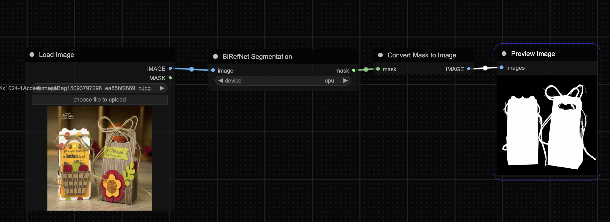

# ComfyUI-BiRefNet

## Introduction

Bilateral Reference Network achieves SOTA result in multi Salient Object Segmentation dataset, this repo pack BiRefNet as ComfyUI nodes, and make this SOTA model easier use for everyone.

## Installation 

1. Go to comfyUI custom_nodes folder, `ComfyUI/custom_nodes/`
2. `git clone https://github.com/viperyl/ComfyUI-BiRefNet.git `
3. `pip install requirements.txt`

## Download Model Checkpoints

Before using BiRefNet, download the model checkpoints with Git LFS:

1. Ensure `git lfs` is installed. If not, [install it](https://git-lfs.github.com/).
2. Download the checkpoints to the ComfyUI models directory by pulling the large model files using git lfs:
   ```bash
   cd ./models/
   git clone https://huggingface.co/ViperYX/BiRefNet
   cd BiRefNet
   git lfs install
   git lfs pull
   ```

## Usage

The demo workflow placed in `workflow/example_workflow.json`



## Sample Result


# Acknowledgments

Thanks to BiRefNet repo owner [ZhengPeng7/BiRefNet: Bilateral Reference for High-Resolution Dichotomous Image Segmentation (github.com)](https://github.com/zhengpeng7/birefnet)

